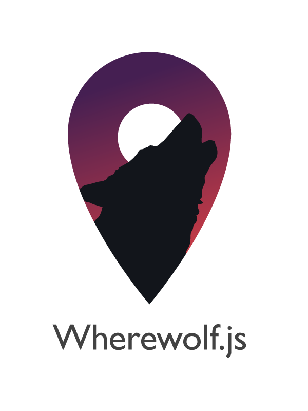

Wherewolf
=========

Wherewolf is a server-less boundary service.  Given a set of geographic features and a point, it will tell you which feature that point lies in.

```js
var teenWolf = Wherewolf();
teenWolf.add("Flood Zone",floodZones);

var result = teenWolf.find({lat: 40.7, lng: -74.1});
console.log(result["Flood Zone"]);
//{zone: "A"}
```

We've used earlier versions of this approach for things like the [2014 Election Guide](http://project.wnyc.org/election-guide-2014/), where you enter your address to see which state assembly, state senate, and congressional district you're in, and [SchoolBook](http://data.schoolbook.org/), where we locate your school district based on your address.

Wherewolf uses latitude/longitude points, so if you're starting from an address, you need to [geocode](http://en.wikipedia.org/wiki/Geocoding) it first.  See the **Examples** section below for how to geocode addresses and feed them to a Wherewolf.

A more full-featured alternative to Wherewolf is [django-boundaryservice](https://github.com/newsapps/django-boundaryservice).  The upside of Wherewolf is that you don't have to configure, administer, or pay for a database or a server.  For some details on performance considerations, see the **Performance** and **Fine Print** sections at the bottom.

# Use/Requirements

You need a GeoJSON or TopoJSON version of your boundaries.

If you're summoning a Wherewolf in a browser, include `wherewolf.js` as a normal script:

```html
<script src="wherewolf.js"></script>
<script>
  var teenWolf = Wherewolf();
</script>
```

If you're using GeoJSON boundaries, there are no dependencies.  If you're using TopoJSON, you must include the TopoJSON client library first:

```html
<script src="http://d3js.org/topojson.v1.min.js"></script>
<script src="wherewolf.js"></script>
```

Wherewolf is available as a [Node module](https://www.npmjs.org/package/wherewolf), installed via npm.

```
npm install wherewolf
```

Wherewolf can also be installed with [Bower](http://bower.io).

```
bower install --save wherewolf
```

# API

To summon a Wherewolf, call the `Wherewolf` constructor:

```js
//The full moon is out
var teenWolf = Wherewolf();
```

## Wherewolf.add(layerName,features[,objectName])

```js
//Add one layer
teenWolf.add("US State",states)

//Add multiple layers
teenWolf.add("US State",states)
        .add("County",counties);
```

Adds a new layer of GeoJSON or TopoJSON features with the name `layerName` to a Wherewolf.

`features` can be any one of:
* A GeoJSON `FeatureCollection`
* An array of GeoJSON features
* A single GeoJSON feature
* A TopoJSON `Topology`

If `features` is a TopoJSON topology with multiple objects (e.g. you have a TopoJSON file with counties and states in the same file), you must specify which `objectName` to add.

```js
teenWolf.add("US County",statesAndCounties,"counties");
```

**Returns:** the updated Wherewolf.

## Wherewolf.addAll(topology)

```js
teenWolf.addAll(statesAndCounties);
```

Adds each TopoJSON object in `topology` as a layer to the Wherewolf. Each object's name is used as its layer name.  The above example is equivalent to:

```js
for (var name in statesAndCounties.objects) {
  teenWolf.add(name,statesAndCounties,name);
}
```

**Returns:** the updated Wherewolf.

## Wherewolf.find(point[,options])

```js
var results = teenWolf.find([-75.15,30.2]);
```

Returns an object with the properties of the matching feature from each Wherewolf layer that the `point` is found in.  For any layer where the point has no match, the result will be `null`.

`point` can be either an array of `[lng,lat]` (LONGITUDE FIRST), or a literal:

```js
var results = teenWolf.find({ lat: 30.2, lng: -75.15 });
```

`options` is an object with two possible options: `layer` and `wholeFeature`.

Setting `layer` to a layer name will get the result for that layer only (default: all layers).

```js
var results = teenWolf.find(point, { layer: "US State" });
```

Setting `wholeFeature` will return the whole matching feature as GeoJSON, rather than just its properties.

```js
var results = teenWolf.find(point, { wholeFeature: true });
```

To see the difference between various options, check out the [Wherewolf options playground](http://veltman.github.io/wherewolf/examples/options/).

**Returns:** the Wherewolf's search results.

## Wherewolf.get(layerName)

```js
var states = teenWolf.get("US State");
```

Returns an array of GeoJSON features saved as layer `layerName`.  If `layerName` does not exist, returns `null`.  The above example would return:

```js
[
  {
    type: "Feature",
    properties: { name: "California" },
    geometry: ...
  },
  {
    type: "Feature",
    properties: { name: "Arizona" },
    geometry: ...
  },
  ...
]
```

**Returns:** an array of GeoJSON features, or `null`.

## Wherewolf.remove(layerName)

```js
teenWolf.remove("County");
```

Remove the layer with name `layerName` if it exists.

**Returns:** the updated Wherewolf object.

## Wherewolf.layerNames()

```js
var names = teenWolf.layerNames();
//["US State","County"]
```

Get the names of all existing layers in a Wherewolf.

**Returns:** an array of current layer names.

# Examples

* [Basic demo](http://bl.ocks.org/veltman/e71f13cd32169f319625)
* [Using .find() options](http://veltman.github.io/wherewolf/examples/options/)
* [Geocode an address](http://bl.ocks.org/veltman/238195622cce0d9d2946)
* [A New York boundary service](http://bl.ocks.org/veltman/b4b981fb85829937fc7c)
* [Node module: add attributes to a CSV](http://veltman.github.io/wherewolf/examples/node/classify-points.js)

# Performance

As a stress test of performance, we tried adding all 3141 counties in the United States as a Wherewolf layer and then searching it for 5000 random nearby points.  In most instances, finding the containing feature for a point took less than a tenth of a millisecond.  In the worst case, it took about 8 milliseconds.

* **Chrome 38 (OS X, Macbook Pro):** 53ms to summon, 0.08ms to search each point
* **Safari 7.0.2 (OS X, Macbook Pro):** 11ms to summon, 0.07ms to search each point
* **Firefox 33 (OS X, Macbook Pro):** 23ms to summon, 0.07ms to search each point
* **Chrome 34 (Android 4.4.4, Nexus 5):** 53ms to summon, 0.72ms to search each point
* **IE9 (Windows 7):** 32ms to summon, 0.62ms to search each point
* **IE10 (Windows 7):** 20ms to summon, 0.54ms to search each point
* **Firefox 29 (Android 2.3.4):** 267ms to summon, 8.2ms to search each point
* **Mobile Safari (iOS 7, iPhone 5C):** 48ms to summon, 1.1ms to search each point
* **Chrome 38 (iOS 7, iPad Mini):** 53ms to summon, 1.74ms to search each point

The main performance limitation when using Wherewolf is the size of the GeoJSON or TopoJSON files you have to load in before you can search.  But you can get these files pretty small by a) converting to TopoJSON, b) removing extraneous attribute info, and c) gzipping.  Even the file of all the counties in the US is only 78k as gzipped TopoJSON, which will download in about 1.8 seconds on a 3G connection, or 73 milliseconds on a 30mbps Wifi connection.

One thing to consider is that loading a data file will be asynchronous, so it won't block the rest of your page from loading.  In most cases, a user is likely to spend some time on the page before doing anything that relies on Wherewolf, so that gives you extra time.  The general pattern might look something like this:


```js
var pending,
    wolf;

//Load the data asynchronously
$.getJSON("school-districts.geojson",function(data){

    //Data is ready, summon the wherewolf
    wolf = Wherewolf();
    wolf.add("School District",data);

    //If there's a pending search, do the lookup
    if (pending) {
        pending = false;
        lookup(pending);
    }

});

//When they try to search, if the data
//has loaded, do the lookup.  Otherwise,
//save the submission as pending for when
//the data finishes
$("#search-button").on("click",function(){
    //add a loading state
    $("div#search-form").addClass("loading");

    //If the data's ready, do the lookup immediately;
    if (wolf) {
        lookup($("input#location").val());
    //Otherwise set it aside as pending
    } else {
        pending = $("input#location").val();
    }
});

function lookup(location) {
    //Lookup the location
    //do some stuff with the results

    //Remove the loading state
    $("div#search-form").removeClass("loading");
}
```

## Getting fancy

If you have concerns about initial load time due to file size, a fancy approach would to be divide the features into subsets and only initially load a GeoJSON file with the bounding box for each subset.  For example, you could have:

* `quadrants.topojson`
* `northwest-us.topojson`
* `southwest-us.topojson`
* `northeast-us.topojson`
* `southeast-us.topojson`

Then you could do something like:

```js
ww.add("quadrant",quadrants);

//When you need to search...
var quadrant = ww.find([lng,lat],{layer:"quadrant"});

//If they are in one of the four rectangles,
//Load that file and search it
//You're only loading/search 25% of the counties
if (quadrant.name) {
  $.getJSON(quadrant.name+".topojson",function(counties){
    ww.add("counties",counties);
    var theCountyTheyAreIn = ww.find([lng,lat],{layer:"counties"});
  });
}
```

In this way, you load very little data up front, but the downside is you introduce some extra delay at the time of the search.

# Fine print

* This will probably not work for a feature that crosses the North or South Pole.
* This may not work for certain special cases of a point that lies right on the antimeridian being checked against a feature that crosses the antimeridian. It's unclear whether any scenario on the actual earth can cause this problem.  The Aleutian Islands work fine.
* Wherewolf will only match against GeoJSON `Polygons`,`MultiPolygons`,and `Points`.  It will not work with a feature that's a `LineString`.
* If your geographic data file is invalid, you may get unpredictable results.  Wherewolf assumes that your polygons do not self-intersect or overlap.  If a point matches more than one feature in one layer, Wherewolf will return the first match it finds.
* Your results will only be as accurate as your data is precise.  If the boundaries you're using are highly simplified, you may get inaccurate results for points near a border.

# Credits/License

By [Noah Veltman](https://twitter.com/veltman) and [Jenny Ye](https://twitter.com/thepapaya)

Special thanks to:

* [WNYC](http://www.wnyc.org/)
* [OpenNews](http://opennews.org) - this was released as part of the November 2014 OpenNews Code Convening
* [Substack](https://github.com/substack) for his [point-in-polygon module](https://github.com/substack/point-in-polygon)
* [Mike Bostock](https://github.com/mbostock) for [TopoJSON](https://github.com/mbostock/topojson)
* [Louise Ma](https://twitter.com/hellolouise) for the logo

Available under the MIT license.

Permission is hereby granted, free of charge, to any person obtaining a copy of this software and associated documentation files (the "Software"), to deal in the Software without restriction, including without limitation the rights to use, copy, modify, merge, publish, distribute, sublicense, and/or sell copies of the Software, and to permit persons to whom the Software is furnished to do so, subject to the following conditions.

The above copyright notice and this permission notice shall be included in all copies or substantial portions of the Software.

THE SOFTWARE IS PROVIDED "AS IS", WITHOUT WARRANTY OF ANY KIND, EXPRESS OR IMPLIED, INCLUDING BUT NOT LIMITED TO THE WARRANTIES OF MERCHANTABILITY, FITNESS FOR A PARTICULAR PURPOSE AND NONINFRINGEMENT. IN NO EVENT SHALL THE AUTHORS OR COPYRIGHT HOLDERS BE LIABLE FOR ANY CLAIM, DAMAGES OR OTHER LIABILITY, WHETHER IN AN ACTION OF CONTRACT, TORT OR OTHERWISE, ARISING FROM, OUT OF OR IN CONNECTION WITH THE SOFTWARE OR THE USE OR OTHER DEALINGS IN THE SOFTWARE.
